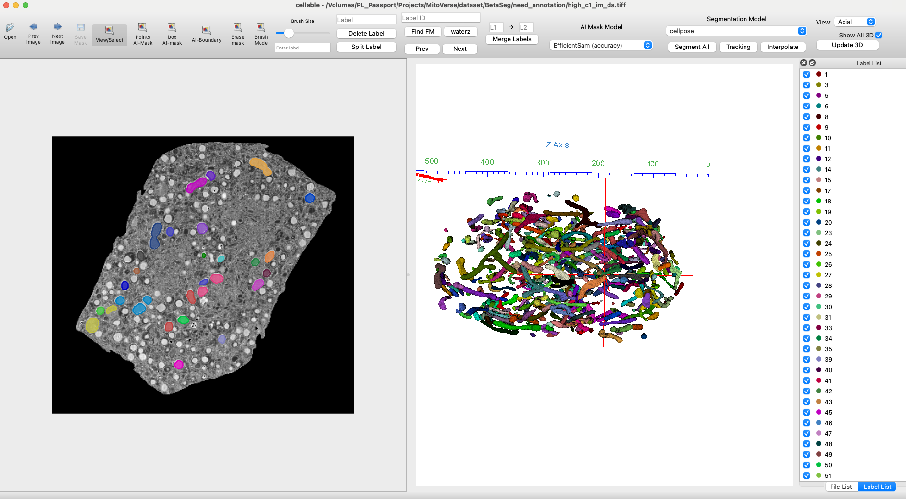
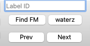

<h1 align="center">
  <br/>Cellable
</h1>

<h4 align="center">
  Cell Organelle Labeling with Python
</h4>

<div align="center">
  <a href="https://pypi.python.org/pypi/labelme"></a>
  <a href="https://pypi.org/project/labelme"></a>
  <a href="https://github.com/labelmeai/labelme/actions"></a>
</div>

<div align="center">
<a href="#installation"><b>Installation</b></a>

  <!-- | <a href="https://github.com/labelmeai/labelme/discussions"><b>Community</b></a> -->
  <!-- | <a href="https://www.youtube.com/playlist?list=PLI6LvFw0iflh3o33YYnVIfOpaO0hc5Dzw"><b>Youtube FAQ</b></a> -->
</div>

<br/>

<div align="center">
  
</div>

## **Overview**

This application is an extended version of [Labelme](https://github.com/wkentaro/labelme), designed for interactive **2D/3D segmentation and annotation** of electron microscopy (EM) and other scientific images.
It supports:

* Viewing and annotating **2D slices** and **3D volumes**
* Loading **TIFF stacks** for volumetric data
* Automatic **AI-assisted segmentation**
* Manual mask editing and refinement
* 3D rendering via **VTK**

---

## **Installation**

### **1. Requirements**

* **Python 3.8+**
* GPU recommended for AI-assisted segmentation
* OS: Linux, macOS, or Windows
### **2. Install Dependencies**


Key dependencies include:

* `PyQt5` – GUI framework
* `vtk` – 3D rendering
* `tifffile` – TIFF image I/O
* `cc3d` – connected component analysis
* `scikit-image`, `scipy`, `numpy` – image processing
* `imgviz` – visualization utilities


```bash
git clone https://github.com/luckieucas/cellable.git
cd cellable

# Setup conda
conda create --name cellable python=3.9
conda activate cellable


# Install dependencies
pip install -r requirements.txt

# Install cellable
pip install -e .
```
---


# **User Manual – Cellable 3D Segmentation Edition**


## **Launching the Application**

```
conda activate cellable

cellable
```


This opens the main **Cellable 3D Segmentation** interface.

---

## **User Interface**

### **1. Main Window**

* **Toolbar**: Open files, save annotations, run AI segmentation, adjust view
* **Canvas Area**: Displays the current image or 3D slice
* **Label List**: Shows all current annotations
* **Status Bar**: Displays slice index, zoom level, and current tool

### **2. File Formats Supported**

* **Images**: `.png`, `.jpg`, `.tif`, `.tiff`
* **Volume stacks**: Multi-page TIFF


---

## **Basic Workflow**

### **Step 1 – Load Data**

1. **Open Image/Stack**: `File → Open`
2. For 3D TIFF stacks, a slider will appear to navigate slices.

### **Step 2 – View and Navigate**

* **Mouse scroll**: Change zoom
* **Arrow keys / slider**: Move between slices

### **Step 3 – Annotate**

* **Polygon Tool**: Draw manual outlines
* **Mask Tool**: Paint masks
* **AI Tool**: Click region to run automatic segmentation

### **Step 4 – Edit Masks**

* Move, resize, or delete shapes
* Merge or split regions
* Adjust brightness/contrast for better visualization

### **Step 5 – Save Annotations**

* `File → Save` stores as `.json` alongside the image
* Mask data can be exported as NumPy arrays

---

## **AI-Assisted Segmentation**

1. **Select the AI Tool** from the toolbar.
2. Click inside the region of interest.
3. The model will run segmentation using:

   * **SAM** (Segment Anything)
   * Watershed segmentation
4. Adjust results manually if needed.

---

## **3D Rendering**

* **View → 3D Viewer**
* Enables VTK-based visualization of masks in 3D
* Rotate, zoom, and inspect segmented structures

---

## **Shortcuts**

| Action              | Shortcut |
| ------------------- | -------- |
| Open File           | `Ctrl+O` |
| Save Annotation     | `Ctrl+S` |
| Zoom In/Out         | `Hold Cmd + Mouse Scroll`  |
| Next Slice          | `D`      |
| Previous Slice      | `A`      |

---

## **Troubleshooting**

* **Laggy performance**: Enable GPU acceleration and close unused windows.
* **Mask misalignment**: Check voxel dimensions in TIFF metadata.
* **VTK viewer not loading**: Ensure `vtk` and `PyQt5` versions are compatible.

---

## **Find False Merge**

#### How to use
1. In the Label ID input field on the right, enter the target label ID you wish to segment.

2. Navigate to a slice containing the adhered instances.

3. Click the waterz button.

4. The application will automatically compute the boundaries and refresh the view. The original single component will now appear as multiple independent regions separated by background pixels.

## **Credits**

This version builds upon the original [Labelme](https://github.com/wkentaro/labelme) and integrates:

* VTK for 3D visualization
* cc3d for connected component analysis
* AI models for auto-segmentation

