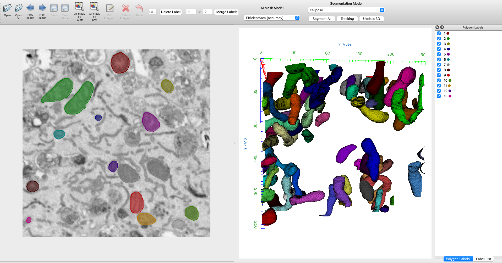

<h1 align="center">
  <br/>cellable
</h1>

<h4 align="center">
  Image Polygonal Annotation with Python
</h4>

<div align="center">
  <a href="https://pypi.python.org/pypi/labelme"></a>
  <a href="https://pypi.org/project/labelme"></a>
  <a href="https://github.com/labelmeai/labelme/actions"></a>
</div>

<div align="center">
<a href="#installation"><b>Installation</b></a>
  | <a href="#usage"><b>Usage</b></a>
  | <a href="#examples"><b>Examples</b></a>
  <!-- | <a href="https://github.com/labelmeai/labelme/discussions"><b>Community</b></a> -->
  <!-- | <a href="https://www.youtube.com/playlist?list=PLI6LvFw0iflh3o33YYnVIfOpaO0hc5Dzw"><b>Youtube FAQ</b></a> -->
</div>

<br/>

<div align="center">
  
</div>


## Installation

```bash
git clone https://github.com/luckieucas/cellable.git
cd cellable

# Install anaconda3 and labelme
curl -L https://github.com/wkentaro/dotfiles/raw/main/local/bin/install_anaconda3.sh | bash -s .
source .anaconda3/bin/activate
pip install -e .
```

## Examples

* [Semantic Segmentation](examples/semantic_segmentation)
* [Instance Segmentation](examples/instance_segmentation)
* [Video Annotation](examples/video_annotation)

### How to build standalone executable

Below shows how to build the standalone executable on macOS, Linux and Windows.  

```bash
# Setup conda
conda create --name labelme python=3.9
conda activate labelme

# Build the standalone executable
pip install .
pip install 'matplotlib<3.3'
pip install pyinstaller
pyinstaller labelme.spec
dist/labelme --version
```


## Acknowledgement

This repo is developed from [wkentaro/labelme](https://github.com/wkentaro/labelme).
