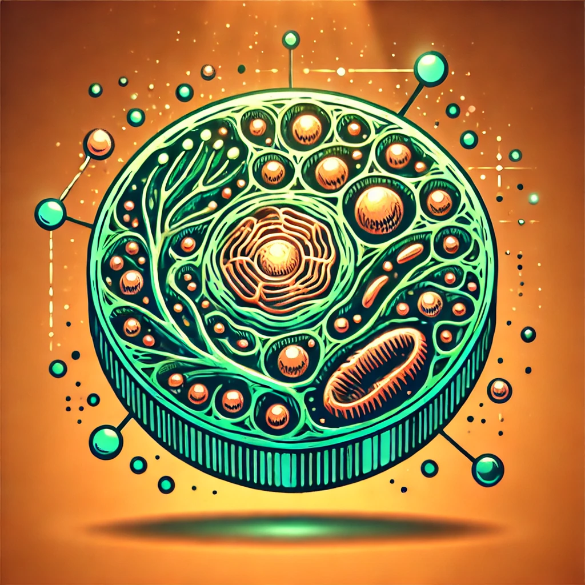
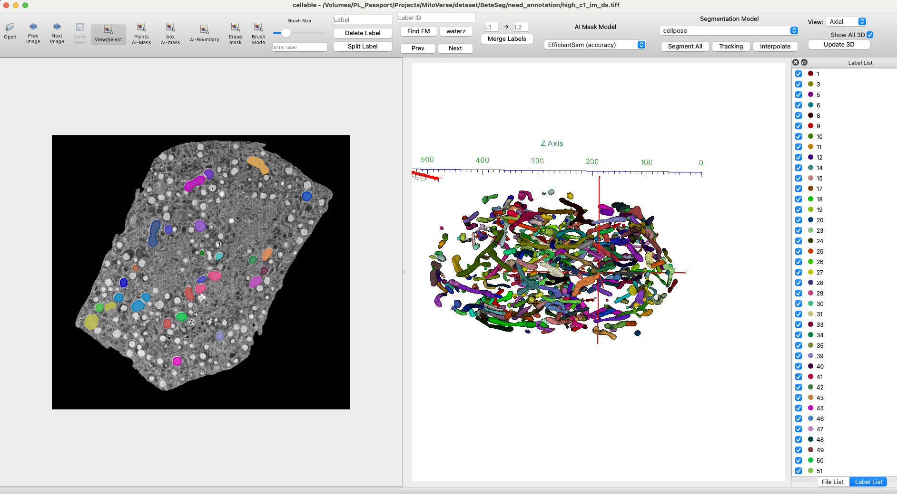
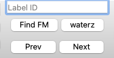

<h1 align="center">
  <br/>Cellable
</h1>

<h4 align="center">
  Cell Organelle Labeling with Python
</h4>

<div align="center">
  <a href="https://pypi.python.org/pypi/labelme"></a>
  <a href="https://pypi.org/project/labelme"></a>
  <a href="https://github.com/labelmeai/labelme/actions"></a>
</div>

<div align="center">
<a href="#installation"><b>Installation</b></a> |
<a href="#tutorial"><b>User Tutorial</b></a> |
<a href="#features"><b>Features</b></a>
</div>

<br/>

<div align="center">
  
</div>

## **Overview**

This application is an extended version of [Labelme](https://github.com/wkentaro/labelme), designed for interactive **2D/3D segmentation and annotation** of electron microscopy (EM) and other scientific images.
It supports:

* Viewing and annotating **2D slices** and **3D volumes**
* Loading **TIFF stacks** for volumetric data
* Automatic **AI-assisted segmentation**
* Manual mask editing and refinement
* 3D rendering via **VTK**

---

## **Installation**

### **1. Requirements**

* **Python 3.8+**
* GPU recommended for AI-assisted segmentation
* OS: Linux, macOS, or Windows

### **2. Install Dependencies**

Key dependencies include:

* `PyQt5` – GUI framework
* `vtk` – 3D rendering
* `tifffile` – TIFF image I/O
* `cc3d` – connected component analysis
* `scikit-image`, `scipy`, `numpy` – image processing
* `imgviz` – visualization utilities

```bash
git clone https://github.com/luckieucas/cellable.git
cd cellable

# Setup conda
conda create --name cellable python=3.9
conda activate cellable

# Install dependencies
pip install -r requirements.txt

# Install cellable
pip install -e .
```

---

## **📚 User Tutorial - Cellable 3D Segmentation Edition**

### **🚀 Getting Started**

#### **Launch the Application**
```bash
conda activate cellable
cellable
```

<div align="center">
  <a href="https://www.youtube.com/watch?v=VIDEO_ID_1" target="_blank">
    
    <div style="position: relative; display: inline-block;">
      
    </div>
  </a>
  <p><em>Video 1: Launching Cellable Application (Click to watch on YouTube)</em></p>
</div>

---

### **🖥️ Interface Overview**

#### **Main Window Layout**
* **Toolbar**: File operations, AI segmentation, view adjustments
* **Canvas Area**: Displays current image or 3D slice
* **Label List**: Shows all current annotations
* **Status Bar**: Displays slice index, zoom level, current tool

<div align="center">
  <a href="https://www.youtube.com/watch?v=VIDEO_ID_2" target="_blank">
    
    <div style="position: relative; display: inline-block;">
      
    </div>
  </a>
  <p><em>Video 2: Interface Overview and Navigation (Click to watch on YouTube)</em></p>
</div>

---

### **📁 Data Loading & Supported Formats**

#### **Supported File Formats**
* **Images**: `.png`, `.jpg`, `.tif`, `.tiff`
* **Volume Data**: Multi-page TIFF stacks

#### **Loading Data Steps**
1. **Open Image/Stack**: `File → Open`
2. For 3D TIFF stacks, a slider will appear for slice navigation

<div align="center">
  <a href="https://www.youtube.com/watch?v=VIDEO_ID_3" target="_blank">
    
    <div style="position: relative; display: inline-block;">
      
    </div>
  </a>
  <p><em>Video 3: Loading Different Types of Data (Click to watch on YouTube)</em></p>
</div>

---

### **️ View Navigation & Operations**

#### **Basic Operations**
* **Mouse Scroll**: Change zoom level
* **Arrow Keys/Slider**: Move between slices
* **Drag**: Pan the view

<div align="center">
  <a href="https://www.youtube.com/watch?v=VIDEO_ID_4" target="_blank">
    
    <div style="position: relative; display: inline-block;">
      
    </div>
  </a>
  <p><em>Video 4: View Navigation Operations (Click to watch on YouTube)</em></p>
</div>

---

### **✏️ Annotation Tools**

#### **1. Polygon Tool - Manual Contour Drawing**
* Click on canvas to create vertices
* Double-click to complete drawing
* Right-click to edit vertices

<div align="center">
  <a href="https://www.youtube.com/watch?v=VIDEO_ID_5" target="_blank">
    
    <div style="position: relative; display: inline-block;">
      
    </div>
  </a>
  <p><em>Video 5: Using the Polygon Tool (Click to watch on YouTube)</em></p>
</div>

#### **2. Mask Tool - Region Painting**
* Select brush size
* Paint mask regions
* Use eraser to remove areas

<div align="center">
  <a href="https://www.youtube.com/watch?v=VIDEO_ID_6" target="_blank">
    
    <div style="position: relative; display: inline-block;">
      
    </div>
  </a>
  <p><em>Video 6: Using the Mask Tool (Click to watch on YouTube)</em></p>
</div>

---

### **🤖 AI-Assisted Segmentation**

#### **SAM (Segment Anything Model) Segmentation**
1. Select the AI tool
2. Click inside the region of interest
3. Automatic segmentation generation

<div align="center">
  <a href="https://www.youtube.com/watch?v=VIDEO_ID_7" target="_blank">
    
    <div style="position: relative; display: inline-block;">
      
    </div>
  </a>
  <p><em>Video 7: SAM AI Segmentation Demo (Click to watch on YouTube)</em></p>
</div>

#### **Efficient SAM - Fast Segmentation**
* Faster segmentation speed
* Suitable for batch processing

<div align="center">
  <a href="https://www.youtube.com/watch?v=VIDEO_ID_8" target="_blank">
    
    <div style="position: relative; display: inline-block;">
      
    </div>
  </a>
  <p><em>Video 8: Efficient SAM Fast Segmentation (Click to watch on YouTube)</em></p>
</div>

#### **Text-to-Annotation Conversion**
* Input descriptive text
* Automatic annotation generation

<div align="center">
  <a href="https://www.youtube.com/watch?v=VIDEO_ID_9" target="_blank">
    
    <div style="position: relative; display: inline-block;">
      
    </div>
  </a>
  <p><em>Video 9: Text-to-Annotation Conversion (Click to watch on YouTube)</em></p>
</div>

---

### **🔧 Mask Editing & Optimization**

#### **Shape Editing**
* Move, resize, or delete shapes
* Merge or split regions
* Adjust brightness/contrast

<div align="center">
  <a href="https://www.youtube.com/watch?v=VIDEO_ID_10" target="_blank">
    
    <div style="position: relative; display: inline-block;">
      
    </div>
  </a>
  <p><em>Video 10: Mask Editing Operations (Click to watch on YouTube)</em></p>
</div>

---

### **🌊 Watershed Segmentation - Instance Separation**

#### **Find False Merge Feature**
1. Enter the target label ID in the Label ID input field on the right
2. Navigate to a slice containing adhered instances
3. Click the waterz button
4. Automatic boundary computation and view refresh

<div align="center">
  
</div>

<div align="center">
  <a href="https://youtu.be/Xt_3Pjgxnl8?si=tk2atLvRp7-hKCMC" target="_blank">
    
  </a>
  <p><em>Video 11: Watershed Segmentation for Instance Separation (Click to watch on YouTube)</em></p>
</div>

---

### **🎨 3D Rendering & Visualization**

#### **VTK 3D Viewer**
* **View → 3D Viewer**
* VTK-based 3D visualization of masks
* Rotate, zoom, and inspect segmented structures

<div align="center">
  <a href="https://www.youtube.com/watch?v=VIDEO_ID_12" target="_blank">
    
    <div style="position: relative; display: inline-block;">
      
    </div>
  </a>
  <p><em>Video 12: Using the 3D Viewer (Click to watch on YouTube)</em></p>
</div>

---

### **💾 Save & Export**

#### **Saving Annotations**
* `File → Save` stores as `.json` format
* Mask data can be exported as NumPy arrays

#### **Export Formats**
* JSON annotation files
* VOC dataset format
* COCO dataset format

<div align="center">
  <a href="https://www.youtube.com/watch?v=VIDEO_ID_13" target="_blank">
    
    <div style="position: relative; display: inline-block;">
      
    </div>
  </a>
  <p><em>Video 13: Save and Export Operations (Click to watch on YouTube)</em></p>
</div>

---

### **⌨️ Keyboard Shortcuts**

> **Note:** Shortcuts do not fire when typing inside text fields (e.g. label search, brush label input). Use `Ctrl+F` or `Ctrl+L` to focus search/input fields first.

#### Navigation
| Action | Shortcut |
|--------|----------|
| Previous slice | `A` |
| Next slice | `D` |
| Axial view | `1` |
| Coronal view | `2` |
| Sagittal view | `3` |

#### Mode Switch
| Action | Shortcut |
|--------|----------|
| View / Select | `V` or `Escape` |
| Brush mode | `B` |
| Erase mode | `E` |
| AI Mask mode | `P` |
| Rectangle mode | `M` |
| 3D Watershed mode | `T` |

#### Label Workflow
| Action | Shortcut |
|--------|----------|
| Verify (Finalize) selected label | `F` |
| Revert selected label to proposed | `R` |
| Reject (delete) selected label | `Delete` or `Backspace` |
| Commit changes | `Ctrl+Enter` (`Cmd+Enter` on Mac) |
| Toggle hide verified in views | `H` |
| Solo current label | `S` |
| Show all labels | `Shift+S` |

#### Search / Focus
| Action | Shortcut |
|--------|----------|
| Focus label search box | `Ctrl+F` |
| Focus brush label input | `Ctrl+L` |

#### 3D
| Action | Shortcut |
|--------|----------|
| Toggle Show All 3D | `Ctrl+3` |

#### General (from config)
| Action | Shortcut |
|--------|----------|
| Open File | `Ctrl+O` |
| Save Annotation | `Ctrl+S` |
| Zoom | `Hold Cmd + Mouse Scroll` |
| Undo | `Ctrl+Z` |
| Redo | `Ctrl+Y` |

---

### **🚀 Advanced Features**

#### **Batch Processing**
* Multiple file annotation
* Automatic progress saving

<div align="center">
  <a href="https://www.youtube.com/watch?v=VIDEO_ID_14" target="_blank">
    
    <div style="position: relative; display: inline-block;">
      
    </div>
  </a>
  <p><em>Video 14: Batch Processing Features (Click to watch on YouTube)</em></p>
</div>

#### **Annotation Quality Control**
* Overlap detection
* Completeness checking
* Statistical reports

<div align="center">
  <a href="https://www.youtube.com/watch?v=VIDEO_ID_15" target="_blank">
    
    <div style="position: relative; display: inline-block;">
      
    </div>
  </a>
  <p><em>Video 15: Annotation Quality Control (Click to watch on YouTube)</em></p>
</div>

---

## **🎯 Features**

### **Core Features**
- ✅ **2D/3D Image Annotation**
- ✅ **AI-Assisted Segmentation (SAM, Efficient SAM)**
- ✅ **Text-to-Annotation Conversion**
- ✅ **Watershed Instance Separation**
- ✅ **3D VTK Visualization**
- ✅ **Multi-format Export Support**

### **Professional Features**
- 📊 **Volume Data Analysis**
- ✏️ **Precise Mask Editing**
- 📊 **Batch Processing Support**

---

## **❓ Troubleshooting & FAQ**

### **Performance Issues**
* **Laggy performance**: Enable GPU acceleration and close unused windows
* **Memory issues**: Reduce the number of simultaneously open files

### **Technical Issues**
* **Mask misalignment**: Check voxel dimensions in TIFF metadata
* **VTK viewer not loading**: Ensure `vtk` and `PyQt5` versions are compatible

### **AI Segmentation Issues**
* **Inaccurate segmentation**: Adjust click position, use manual editing for optimization
* **Model loading failure**: Check network connection and model file integrity

---

## **🔗 Advanced Tutorials**

### **Custom Annotation Workflows**
* Create annotation templates
* Set annotation rules
* Quality check procedures

### **Data Preprocessing**
* Image enhancement
* Format conversion
* Batch renaming

---

## **🤝 Community & Support**

* **GitHub Issues**: Report bugs and feature requests
* **Discussions**: Share experiences and best practices
* **Contributing Guide**: Participate in project development

---

## **Credits**

This version builds upon the original [Labelme](https://github.com/wkentaro/labelme) and integrates:

* VTK for 3D visualization
* cc3d for connected component analysis
* AI models for auto-segmentation
* Efficient SAM for fast segmentation
* Text-to-annotation capabilities

---

## **📖 Additional Resources**

* [Original Labelme Project](https://github.com/wkentaro/labelme)
* [SAM Model Paper](https://arxiv.org/abs/2304.02643)
* [VTK Documentation](https://vtk.org/documentation/)
* [Electron Microscopy Image Processing Best Practices](https://example.com/em-best-practices)

---

<div align="center">
  <p><strong>🎉 Start using Cellable for professional cell organelle annotation!</strong></p>
  <p>For questions, check the tutorial videos or submit a GitHub Issue</p>
</div>

## **🔍 问题分析**

GitHub README的限制：
- ❌ 不支持HTML `<video>` 标签的视频播放
- ❌ 不支持嵌入式YouTube播放器
- ❌ 不支持JavaScript交互
- ✅ 只支持静态图片和链接

## ** 解决方案**

### **方案1: 使用YouTube缩略图 + 播放按钮图标 (推荐)**

```markdown:README.md
<code_block_to_apply_changes_from>
<div align="center">
  <a href="https://youtu.be/Xt_3Pjgxnl8?si=tk2atLvRp7-hKCMC" target="_blank">
    
    <div style="position: relative; display: inline-block;">
      
    </div>
  </a>
  <p><em>Video 11: Watershed Segmentation for Instance Separation (Click to watch on YouTube)</em></p>
</div>

# Pack to exe
```bash
pyinstaller --name=cellable ^
    --windowed ^
    --icon=labelme/icons/icon.ico ^
    --add-data "labelme/config/default_config.yaml;labelme/config" ^
    --add-data "labelme/icons;labelme/icons" ^
    --add-data "labelme/translate/*.qm;translate" ^
    --hidden-import=osam._models.yoloworld.clip ^
    --hidden-import=em_util ^
    --collect-all osam ^
    --collect-all PyQt5 ^
    --recursion-limit=5000 ^
    --clean ^
    labelme/__main__.py
```

## macOS 打包（可安装 .dmg，包含模型）

在 macOS 上推荐用 PyInstaller 生成 `Cellable.app`，再用 `hdiutil` 打包成可双击安装的 `Cellable-macOS.dmg`（拖拽到 Applications 即可）。该流程会把 `labelme/models/*.onnx` 一并打包进应用，离线也能使用（无需首次运行下载）。

```bash
# 生成 .app + .dmg（会自动创建 conda 环境、安装依赖、下载模型并打包进应用）
chmod +x scripts/build_macos_installer.sh
./scripts/build_macos_installer.sh
```

产物输出：
- `dist/Cellable.app`
- `dist/Cellable-macOS.dmg`

可选签名：
- `CODESIGN_IDENTITY="Developer ID Application: ..."` 使用开发者证书签名
- `ADHOC_SIGN=0` 跳过 ad-hoc 签名

### 详细命令教程（推荐照做）

1) 安装依赖（只需要一次）
```bash
# macOS 自带 hdiutil；打包脚本使用 conda 来创建隔离环境
conda --version
```

2) 一键打包（最推荐）
```bash
chmod +x scripts/build_macos_installer.sh
./scripts/build_macos_installer.sh
```

3) 打开/安装
```bash
open dist/Cellable-macOS.dmg
# 然后把 Cellable.app 拖到 Applications
```

4) 验证模型已打包（可选）
```bash
find dist/Cellable.app -name '*.onnx' | head
```

### 常见问题

- **提示“无法打开，因为来自身份不明的开发者”**：这是未做 Apple 公证(notarization)时的常见提示。你可以在“系统设置 → 隐私与安全性”里允许打开，或使用 `CODESIGN_IDENTITY` 进行签名后再分发。
